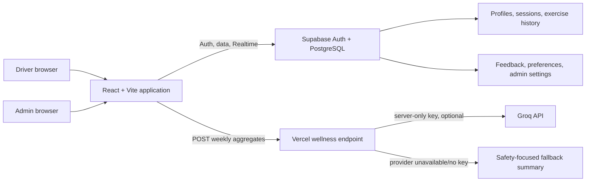
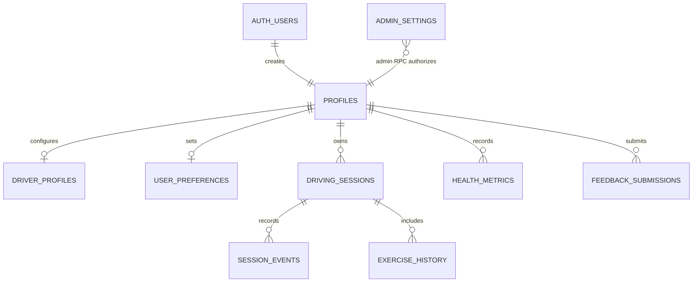
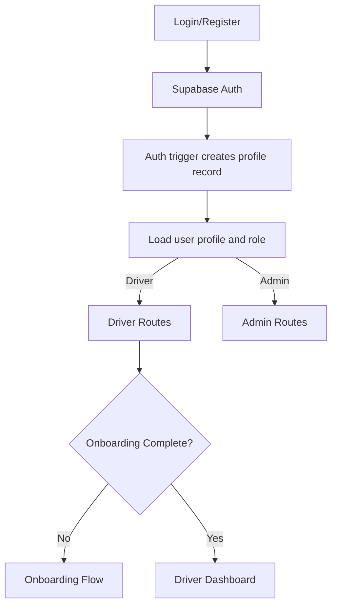

# MOOVE

<p align="center">
  
</p>

<p align="center"><strong>Preventive wellness support for people who spend long hours driving.</strong></p>

MOOVE is a responsive web application for Filipino drivers that turns long sedentary driving periods into opportunities for safe, short movement breaks. It combines driving-session tracking, a context-rated exercise library, wellness summaries, reminder preferences, and a research-facing administration area for usability validation.

> **Scope notice:** MOOVE provides preventive wellness guidance only. It is not a diagnostic, treatment, or emergency service. Exercises and breaks must only be performed when it is safe to do so—typically while parked or stopped as indicated in the application.

## Overview

Long periods behind the wheel can make it difficult for drivers to notice or act on discomfort, fatigue, and prolonged inactivity. MOOVE is designed for private-car, ride-hailing, taxi, delivery, truck, bus, and van drivers who need practical movement prompts that fit around real driving routines.

The application guides a driver through onboarding, an optional pre-drive warm-up, an active session with configurable break reminders, and a post-session summary. It records completed sessions and exercise history in Supabase when configured, and surfaces personal activity, sedentary time, wellness engagement, and recommendations. Researchers and administrators have separate routes for participant, session, feedback, and testing configuration review.

## Finalized problem statement

> Licensed drivers across the Philippines who regularly experience prolonged vehicle-based sedentary periods during their daily driving routines need preventive health opportunities that can be integrated naturally into their everyday driving experiences because current preventive health interventions are primarily designed for dedicated exercise, workplace wellness programs, or clinical settings rather than the real-world constraints of prolonged driving, leaving drivers with limited opportunities to practice preventive health behaviors during one of the most sedentary and recurring parts of their daily lives.

## Target beneficiary group

MOOVE is designed for licensed drivers in the Philippines whose daily routine includes extended or repeated vehicle use: private-car, ride-hailing, taxi, delivery, truck, bus, and van drivers. The primary audience is adults who can safely use the application before driving, while parked, or after driving. It is preventive-wellness support, not a diagnostic, treatment, or emergency service.

## Proposed solution

MOOVE combines the following implemented elements:

- A timed driving-session workflow with pause/resume, break, warm-up, cooldown, and completion states.
- Ten exercise records with instructions, duration, target areas, safety notes, contextual safety ratings, and demonstration videos where available.
- Recommendation selection that considers the current context, recent exercises, completed exercises, and a driver's reported problem areas.
- Configurable movement-break intervals and delivery styles: browser pop-up, sound, vibration, or silent in-app reminder.
- Supabase-backed storage for profiles, preferences, driving sessions, exercise history, health metrics, feedback, administrator settings, onboarding profiles, and session events.
- An optional server-side Groq-powered weekly wellness summary with a deterministic safety-focused fallback when no API key is present or the provider is unavailable.

## Application workflow

1. A driver registers or signs in, then completes onboarding with driving-routine, problem-area, reminder, and notification preferences.
2. The driver starts a driving session and can use the optional warm-up, context-aware movement breaks, pause/resume controls, and cooldown flow when safe.
3. MOOVE records session activity and completed or skipped exercises in Supabase when configured.
4. Dashboards and recommendations summarize driving, sedentary exposure, movement engagement, and wellness patterns.
5. Participants can submit structured usability feedback and complete think-aloud testing.
6. Administrators review feedback, participants, session analytics, action plans, iterations, and exportable TRL-4 documentation.

## Minimum viable product (MVP)

### Driver application

| Area | What is implemented |
| --- | --- |
| Authentication | Email/password registration, sign-in, sign-out, password-reset request, Supabase session restoration, and local/demo fallback paths. |
| Onboarding | Eight-step setup captures vehicle/driver type, daily driving duration, schedule, problem areas, reminder interval/style, warm-up preference, and notification preference. It writes to `profiles`, `user_preferences`, and `driver_profiles`. |
| Driving sessions | Start, pause, resume, recover an active session after refresh, take context-specific breaks, complete or skip exercises, optionally do warm-up/cooldown exercises, add notes, and save a final session report. |
| Sedentary monitoring | Session elapsed and sedentary duration produce Low, Moderate, High, or Very High risk guidance in the session flow. A separate monitor summarizes sessions. |
| Exercise library | Ten guided micro-movements, grouped as Upper Body and Lower Body & Eyes, with filters/details, safety context ratings, instructions, repetitions, and video playback. |
| Health views | Dashboard and preventive health dashboard present activity, driving, sedentary, streak, exercise, and engagement summaries. Supabase-backed views are used for non-demo data where implemented; demo/mock states remain available. |
| AI insights | The recommendation page derives behavioral insights from completed sessions and onboarding preferences. The completed-session flow also creates a local heuristic summary; the weekly wellness API can produce a Groq summary. |
| Health education | Four built-in educational articles on prolonged sitting, micro-movements, safe stretching, and preventive wellness. |
| Feedback and testing | Structured feedback captures ratings, task success, feature impressions, improvement requests, device/browser information, and free text. Think-aloud testing offers ten moderated usability questions and stores responses locally. |
| Settings | Profile fields and notification/reminder preferences can be updated. |

### Research and administrator application

| Module | Data and behavior |
| --- | --- |
| Research Dashboard | Displays research KPIs, desirability/feasibility/viability indicators, feature feedback, intent, session, and bug summaries. It includes local testing-data support. |
| Participants | Lists feedback participants from Supabase where available, with local feedback fallback. |
| Analytics | Calculates session duration, exercise completion, session count, and participant metrics from administrator session queries. |
| Feedback Analytics | Reviews detailed feedback, ratings, bugs, action plans, and iteration notes. Some testing artifacts are intentionally local-browser data. |
| Demo Monitoring | Shows Supabase administrator session records and listens for saved-session events in the current browser. |
| Settings | Manages testing configuration through `admin_settings` and a local cache; database writes use an admin-checked RPC. |
| Think-Aloud | Reuses the moderated driver think-aloud component under an administrator route. |

### Safety and resilience

- Exercise context matrix: `traffic`, `parked`, `before`, and `after` ratings of `safe`, `caution`, or `unsafe`.
- Browser notifications degrade safely when the Notification, Audio, or Vibration API is unavailable.
- An error boundary supplies recovery and home actions for unexpected UI errors.
- Pages are route-level lazy loaded with a loading state.

## Screenshots

The following screenshots reflect the current MOOVE prototype. Source files are maintained in [`docs/screenshots/`](docs/screenshots/).

### Public and driver experience

| Landing page | Authentication |
| --- | --- |
|  |  |

| Driver dashboard | Driving session |
| --- | --- |
|  |  |

| Exercise library | Preventive health dashboard |
| --- | --- |
|  |  |

| AI insights | Sedentary monitoring |
| --- | --- |
|  |  |

| Feedback dashboard | Profile and settings |
| --- | --- |
|  |  |

| Learning dashboard |
| --- |
|  |

### Research and administration

| Research dashboard | Participants |
| --- | --- |
|  |  |

| Analytics | Feedback analytics |
| --- | --- |
|  |  |

| Demo monitoring | Research settings |
| --- | --- |
|  |  |

## Technology stack

| Category | Technology |
| --- | --- |
| Frontend | React 19, React DOM 19, TypeScript 5.7, React Router 8.3 |
| Styling | Tailwind CSS 4 via `@tailwindcss/vite` |
| Build and development | Vite 8, Node.js 22, pnpm 10.34.3, oxfmt 0.2 |
| Backend/API | Vercel serverless function at `api/ai/wellness-summary.ts`; an included Hono/Deno Supabase function scaffold for Figma Make data |
| Database and auth | Supabase (`@supabase/supabase-js` 2.112), Supabase Auth, PostgreSQL, Row Level Security |
| AI | Groq OpenAI-compatible Chat Completions API; default model `llama-3.3-70b-versatile` |
| Browser capabilities | Notifications API, Web Audio API, Vibration API, Supabase Realtime |
| Deployment | Vercel SPA rewrite configuration; Figma Make-compatible Vite configuration |

## Architecture



The browser creates a singleton Supabase client only when `VITE_SUPABASE_URL` and an anon/publishable key are supplied. It uses a dedicated `moove-auth-token` storage key so Figma Make's client is not reused. Core session and onboarding helpers use Supabase first. The app deliberately includes demo accounts, mock data, and browser-local fallback paths so it can be explored without a configured backend; those fallbacks are not a multi-device source of truth.

The Vercel API route accepts aggregate weekly values only. It validates non-negative numeric inputs, limits generation to 150 tokens, applies a nine-second timeout, and returns a preventive-language fallback summary on failure.

## Database design

### Runtime data model

The active React data layer currently queries the following core tables. The base migration also contains additional legacy/research tables; see [Schema notes](#schema-notes) before relying on them.



| Table/view | Key relationships and purpose |
| --- | --- |
| `profiles` | Primary key `id` references `auth.users(id)`; stores driver/admin role, user profile fields, onboarding state, and login timestamp. |
| `driver_profiles` | `user_id` is both primary key and foreign key to `profiles`; normalizes driver type, schedule, problem areas, and reminders. |
| `user_preferences` | Per-user preferences keyed by `user_id`; stores reminder and notification settings. |
| `driving_sessions` | UUID primary key; `user_id` references the profile. Stores lifecycle status, timing, reminders, exercise totals, score, calories, notes, and optional AI summary. |
| `session_events` | Append-only event timeline linked to both a session and user profile, with an event type, elapsed seconds, timestamp, and JSON payload. |
| `exercise_history` | Links a user and optional session to a catalog exercise ID and completion/skip details. A partial unique index prevents duplicate `(user, session, exercise, context)` history rows. |
| `health_metrics` | Per-user recorded wellness, stress, posture, and calorie fields. |
| `feedback_submissions` | Authenticated user feedback, test metadata, ratings, open responses, bug report, device/browser, and submission time. |
| `admin_settings` | Key/value settings for shared testing configuration; writes happen through `upsert_admin_setting`. |
| `driver_daily_metrics` | Security-invoker view derived from completed `driving_sessions`, grouped by user and date. |

### Security model

- A database trigger creates each new user's `profiles` row with the `driver` role; browser sign-up metadata cannot promote a role.
- `prevent_role_change` blocks client role escalation, and `is_admin()` is a security-definer authorization helper used by policies and the settings RPC.
- RLS limits normal users to their own profiles, sessions, exercise history, session events, driver profile, and feedback. Administrators can read permitted cross-user records.
- Administrator setting writes are authorized in the `upsert_admin_setting` database function, not merely hidden by the client UI.
- Indexes support user/session and admin-report queries. The Realtime migration adds `driving_sessions` to Supabase Realtime.

### Schema notes

`src/lib/migrations.sql` is the historical base schema. It defines additional tables such as `sedentary_logs`, `ai_insights`, `notifications`, learning, recommendation, analytics, survey, research, audit, and developer-simulation tables. The current React code does **not** query most of those tables. Keep or retire them only after checking any deployed service dependencies. `DATABASE_AUDIT.md` documents this distinction.

## Project structure

```text
MOOVE/
├── api/ai/wellness-summary.ts        # Vercel Groq/fallback wellness endpoint
├── src/
│   ├── assets/videos/                # Bundled exercise videos
│   ├── components/                   # Error boundary and reusable video player
│   ├── context/AuthContext.tsx       # Auth, demo accounts, local fallback
│   ├── data/                         # Exercise catalog, videos, mock data
│   ├── imports/                      # Logos, mascot, profiles, source media, reference notes
│   ├── layouts/                      # Protected driver and admin shells
│   ├── lib/                          # Supabase singleton, persistence helpers, base SQL
│   ├── pages/
│   │   ├── admin/                    # Research/admin routes
│   │   ├── auth/                     # Login, register, forgot password
│   │   └── driver/                   # Driver wellness and research-testing routes
│   ├── services/                     # Analytics, notifications, AI API client
│   ├── App.tsx                       # Error and auth providers
│   ├── index.css                     # Tailwind entry point and global theme
│   ├── main.tsx                      # React mount
│   └── routes.tsx                    # Lazy-loaded route map
├── supabase/
│   ├── functions/server/             # Figma Make Hono/KV function scaffold
│   └── migrations/                   # Security, SSOT, and Realtime migrations
├── utils/supabase/info.tsx           # Figma Make Supabase compatibility exports
├── .env.example                      # Development environment template
├── .env.production.example           # Production environment template
├── DATABASE_AUDIT.md                 # Database implementation and rollout audit
├── SUPABASE_SSOT_HANDOFF.md          # Supabase-first rollout guidance
├── package.json                      # Scripts and package versions
├── vite.config.ts                    # Vite, Tailwind, Figma Make, and server settings
└── vercel.json                       # SPA rewrite
```

The `src/imports/pasted_text/` files are project/reference notes imported with the design workspace; they are not runtime modules. `dist/` and `node_modules/` are generated directories and should not be treated as source.

## Installation and local development

### Prerequisites

- Git
- Node.js **22** (declared in `.mise.toml`)
- pnpm **10.34.3** or npm (both lockfiles are present)
- A Supabase project for persistent auth/data
- A Groq API key only if you want provider-generated weekly summaries

### Clone and install

```bash
git clone <repository-url>
cd MOOVE
npm install
```

You may use `pnpm install` instead if your team standardizes on the included `pnpm-lock.yaml`.

### Configure the environment

Copy `.env.example` to `.env` and populate values for your Supabase project. Never commit a populated `.env` file.

| Variable | Required | Example | Purpose |
| --- | --- | --- | --- |
| `VITE_SUPABASE_URL` | Yes for Supabase | `https://your-project.supabase.co` | Browser Supabase project URL. |
| `VITE_SUPABASE_ANON_KEY` | Yes for Supabase | `eyJ...` | Browser-safe publishable/anon key protected by RLS. `VITE_SUPABASE_PUBLISHABLE_KEY` is supported temporarily as a compatibility fallback. |
| `VITE_APP_NAME` | No | `MOOVE` | Public app label/configuration. |
| `VITE_APP_ENV` | No | `development` | Public environment label. |
| `VITE_API_BASE_URL` | No | empty for same origin | Prefix for `/api/ai/wellness-summary`; leave blank for Vercel same-origin deployment. |
| `GROQ_API_KEY` | No | `gsk_...` | **Server-only** key used by the Vercel wellness endpoint. Do not prefix it with `VITE_`. |
| `GROQ_MODEL` | No | `llama-3.3-70b-versatile` | Optional Groq model override. |
| `NODE_ENV` | No | `development` | Node/server environment. |
| `PORT` | No | `8443` | Vite dev/preview port; Vite defaults to 8443 in this project. |

Without Supabase configuration, the application still exposes the local/demo experience. Password-reset delivery and persistent cross-device data require Supabase.

### Set up Supabase

1. Create a Supabase project and obtain its Project URL and anon/publishable key.
2. Configure these values in `.env` using the table above.
3. Back up any existing project database before applying migrations.
4. In the Supabase SQL Editor (or via your migration workflow), apply migrations in this order:

   ```text
   src/lib/migrations.sql
   supabase/migrations/20260805_security_and_data_integrity.sql
   supabase/migrations/20260805_ssot_sessions_and_onboarding.sql
   supabase/migrations/20260805_enable_driving_sessions_realtime.sql
   ```

5. Review the administrator promotion statement in the security/SSOT migration, then promote only a reviewed account. The repository targets `admin@moove.app` in the included SQL.
6. In Supabase Auth, configure the site's redirect URL so the password-reset path resolves at `<your-origin>/auth/reset-password`. Note that this route is not presently defined in `routes.tsx`; add it before treating password reset completion as production ready.
7. Test sign-up, onboarding persistence, session creation/completion, feedback submission, an admin settings write, and a non-admin access attempt.

The migrations are additive and intended to preserve existing data. See `SUPABASE_SSOT_HANDOFF.md` and `DATABASE_AUDIT.md` for rollout cautions; do not modify existing migrations merely to run the setup.

### Run the application

```bash
npm run dev
```

This starts Vite on `http://localhost:8443` by default (`--host 0.0.0.0`). There is no `server` or `dev:full` script in this repository: the frontend runs through Vite, Supabase is external, and the AI endpoint is deployed as a Vercel serverless function.

Useful additional commands:

```bash
npm run build     # creates the production bundle in dist/
npm run preview   # serves the built bundle on PORT or 8443
npm run format    # runs oxfmt
```

### Demo accounts

These accounts are hard-coded for local exploration and do not authenticate against Supabase:

| Role | Email | Password |
| --- | --- | --- |
| Driver demo | `driver@moove.app` | `Driver123!` |
| Research admin demo | `admin@moove.app` | `Admin123!` |

Do not use these credentials as production accounts.

## AI integration

The client sends weekly aggregate activity data—driving minutes, completed exercises/sessions, exercise completion rate, and optional tired areas—to `POST /api/ai/wellness-summary`. The Vercel function validates the payload and, if `GROQ_API_KEY` is available, calls Groq's OpenAI-compatible chat-completions endpoint. Its system prompt constrains the output to a concise preventive wellness summary: no diagnosis, prescription, medical outcome claim, or advice to exercise while driving.

The endpoint returns `{ summary, source }`, where `source` is `groq` or `fallback`. A fallback means the client can remain usable without an AI credential or during provider failure. In-browser recommendations use deterministic session and preference logic; they do not send a full personal profile to Groq.

## API documentation

MOOVE has one application HTTP API route. Supabase access is performed through the browser SDK under the database's Row Level Security policies; there is no separate REST-controller layer in this repository.

| Route | Method | Request | Response | Description |
| --- | --- | --- | --- | --- |
| `/api/ai/wellness-summary` | `POST` | `weeklyDrivingMinutes`, `completedExercises`, `completedSessions`, and `exerciseCompletionRate` non-negative numbers; optional `tiredAreas` string array | `{ summary: string, source: "groq" \| "fallback" }` | Produces a concise preventive weekly wellness summary. Returns `400` for invalid payloads and `405` for other methods. |

The client also calls the Supabase `upsert_admin_setting` RPC to write administrator settings after database-side authorization. The repository includes a Deno/Hono Supabase function scaffold under `supabase/functions/server/`; it is infrastructure support for the Figma Make environment, not a driver-facing API route.

## User interface overview

| Area | Implemented pages |
| --- | --- |
| Public and authentication | Landing page, login, registration, and password-reset request |
| Driver workspace | Dashboard, driving sessions, guided exercises, AI recommendations, sedentary monitoring, health dashboard, education, feedback, settings, onboarding, research dashboard, and think-aloud testing |
| Administrator workspace | Dashboard, participants, analytics, feedback analytics, demo monitoring, settings, and think-aloud testing |

The route map is defined in [`src/routes.tsx`](src/routes.tsx). Pages are lazy-loaded, while the driver and administrator layouts enforce the appropriate access path.

## Authentication and access control


- `AuthProvider` restores a Supabase session, listens for auth-state changes, and loads the matching profile.
- Driver and admin layouts redirect unauthenticated visitors to `/auth/login`; `AdminLayout` redirects non-admins to the driver dashboard.
- Drivers who have not completed onboarding are redirected to `/driver/onboarding`, except for the explicit demo and admin accounts.
- Supabase database role—not browser-controlled sign-up metadata—determines persistent administrator access.
- A local account store exists as a no-Supabase fallback. It is suitable for prototype/demo use only, not secure production authentication.

## Performance and reliability

- Every route page is loaded with `React.lazy` and `Suspense`.
- Supabase client construction is cached on `globalThis` across Vite HMR updates.
- Session, exercise, and feedback queries have indexes added by the security migration; the analytics service restricts history reads and session queries use limits.
- Realtime refresh is scoped to a driver's weekly completed sessions.
- Browser feature use is capability-checked and failure-tolerant.

## Deployment

The application is configured for Vercel. `vercel.json` explicitly uses the Vite build command and `dist` output directory, then rewrites unknown routes to `index.html` so React Router browser routes load directly. Hashed assets in `src/assets` and direct Vite imports from `src/imports` are emitted to `dist/assets`; do not replace these imports with manually constructed `/src/...` URLs. Vercel automatically recognizes `api/ai/wellness-summary.ts` as a serverless API function.

### Required Git LFS setting

The MOOVE logo, mascot, profile photos, and exercise videos are tracked with Git LFS. In Vercel, open **Project Settings → Git** and enable **Git LFS**, then redeploy. Without this setting Vercel checks out small LFS pointer files instead of the real binary files; Vite can still complete the build, but browsers receive invalid image/video responses. The `prebuild` verifier now catches that condition and fails the deployment with a clear message.

Keep the current split for the bundled MVP: branding images and the ten short exercise videos are Vite imports, giving each file a hashed production URL and case-safe filename. The project currently ships roughly 87 MB of exercise video. Before the library expands or videos become higher resolution, move videos to a public `exercise-media` Supabase Storage bucket (for example, `exercise-videos/chin-tucks.mp4`) or a media CDN. Store the object path in exercise data and generate public or signed URLs with `supabase.storage.from('exercise-media').getPublicUrl(path)`; keep logo and mascot imports in the app bundle.

1. Import the repository into Vercel.
2. In **Settings → Git**, enable **Git LFS** and redeploy if it was previously disabled.
3. Set `VITE_SUPABASE_URL`, `VITE_SUPABASE_ANON_KEY`, and any public API base URL in the Vercel project environment.
4. Set `GROQ_API_KEY` and optionally `GROQ_MODEL` as server-only environment variables.
5. Use build command `npm run build`; the output directory is `dist`.
6. Add the deployed origin to Supabase Auth redirect/allowed URL configuration.

## Troubleshooting

| Symptom | Checks |
| --- | --- |
| Blank screen or error view | Open browser devtools, confirm `.env` values are present at build time, and run `npm run build` to identify TypeScript/Vite errors. |
| Supabase requests fail | Verify project URL/key, project status, migration order, authenticated session, table grants, and RLS policies. The migrations must be applied before core writes. |
| Admin settings denied | Confirm the user has a `profiles.role` of `admin`, is signed in through Supabase rather than a demo session, and the latest `upsert_admin_setting` function is installed. |
| AI response is fallback | This is expected when `GROQ_API_KEY` is absent or Groq times out/fails. Check that the key is set only on the server and that `VITE_API_BASE_URL` points to the deployment if it is cross-origin. |
| Password reset link does not complete | Configure Supabase redirect URLs and add the currently missing `/auth/reset-password` route before production use. |
| Browser reminders do not appear | Check browser notification permissions, HTTPS/browser policy, enabled notification preferences, and whether the selected reminder style is silent. |

## Recommended developer workflow

1. Pull the latest changes and install dependencies.
2. Copy/configure the environment template.
3. Apply the SQL migrations to a Supabase staging project in the documented order.
4. Start `npm run dev` and test both a real Supabase account and the demo accounts.
5. Verify driver onboarding, session lifecycle, feedback, and admin authorization.
6. Run `npm run build` before deployment.

## Research contribution

MOOVE investigates how context-aware micro-break guidance can fit preventive health behavior into prolonged driving routines. Its intervention model combines sedentary-time awareness, short movement options with explicit safety contexts, configurable reminders, and post-session reflection. The research workspace captures structured ratings, task outcomes, feature feedback, free-text comments, and think-aloud responses so usability evidence can inform subsequent iterations.

## Technology Readiness Level (TRL-4)

MOOVE is documented as a TRL-4 research prototype because the repository implements an integrated, end-to-end system rather than isolated screens or components:

- The React frontend, Supabase authentication, PostgreSQL persistence, Row Level Security, driver workflow, notifications, analytics, feedback collection, administrator review, and optional AI wellness summary work as connected modules.
- A driver can progress from onboarding through session recording, exercise activity, feedback, and history; administrators can review collected evidence and generate structured TRL-4 reports.
- The feedback analytics module records validation data, action plans, iteration history, export history, and a print-ready research report. Its exported report documents synthesis, prototype revision, revalidation, and finalization activities.
- The implementation remains a controlled research prototype with local/demo fallbacks and documented production gaps; it is not represented as a large-scale deployed healthcare service.

Together, these capabilities provide evidence of technical feasibility and integrated validation in a controlled context, supporting progression toward higher readiness levels after broader deployment and evaluation.

## Future improvements

- Move remaining local-browser research artifacts (feedback action plans, iterations, think-aloud responses, and legacy dashboard readers) into authenticated normalized Supabase tables.
- Add the missing password-reset completion route and integration tests for the full authentication flow.
- Replace browser aggregate loops with paginated RPCs/views for larger study cohorts.
- Add automated tests for session recovery, RLS ownership/admin boundaries, duplicate event handling, and multiple tabs.
- Require authentication/authorization at the wellness endpoint before sending any user-linked aggregate data.
- Add a documented, user-approved local-data export/import migration path.

## Contributors

The landing page identifies Anne Carol Jonson and Jean Abrey Serva as the people behind MOOVE. Add contributors here as the project grows:

- Anne Carol Jonson
- Jean Abrey Serva
- Contributors: please open an issue or pull request with a clear description and validation steps.

## License

No `LICENSE` file is currently included in this repository. Treat the project as **all rights reserved/proprietary until the maintainers add an explicit license**.

## Acknowledgements

Built with React, Vite, Tailwind CSS, React Router, Supabase, Vercel, Groq, and the browser platform APIs used for notifications, audio, and vibration. The exercise media and MOOVE logo/mascot assets are included in the repository.
